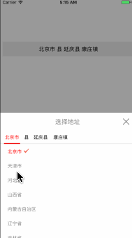

# ZHFJDAddress
### 这是一个自定义仿京东地址选择器--Swift版本（保证集成成功，有不懂的地方可加QQ：991150443 进行讨论。）
OC版本地址：

`
https://github.com/FighterLightning/ZHFJDAddressOC.git

---

 
 

#### Demo的使用须知:
 1. 下载该demo。把ProvinceModel.swift（必须），ZHFAddTitleAddressView.swift(必须) AddressCell.swift(必须)  NetworkTools.swift(可用自己封装的)拖进项目

 2. 在 Podfile 中添加:
 * `pod 'AFNetworking'`//网络请求（建议用Swift版本的）
 
 * `pod 'YYModel'`//字典转模型（建议用Swift版本的）

 * `pod 'Chrysan', :git => 'https://github.com/Harley-xk/Chrysan.git'`//第三方加载框（根据需求进行添加）
 	
 3. 网络请求看ZHFAddTitleAddressView.swift头部注释根据需求进行修改
 
 
# PS

 如果感觉有帮助，不要吝啬你的星星哦！
 该demo地址：
 
 `
 https://github.com/FighterLightning/ZHFJDAddress.git
